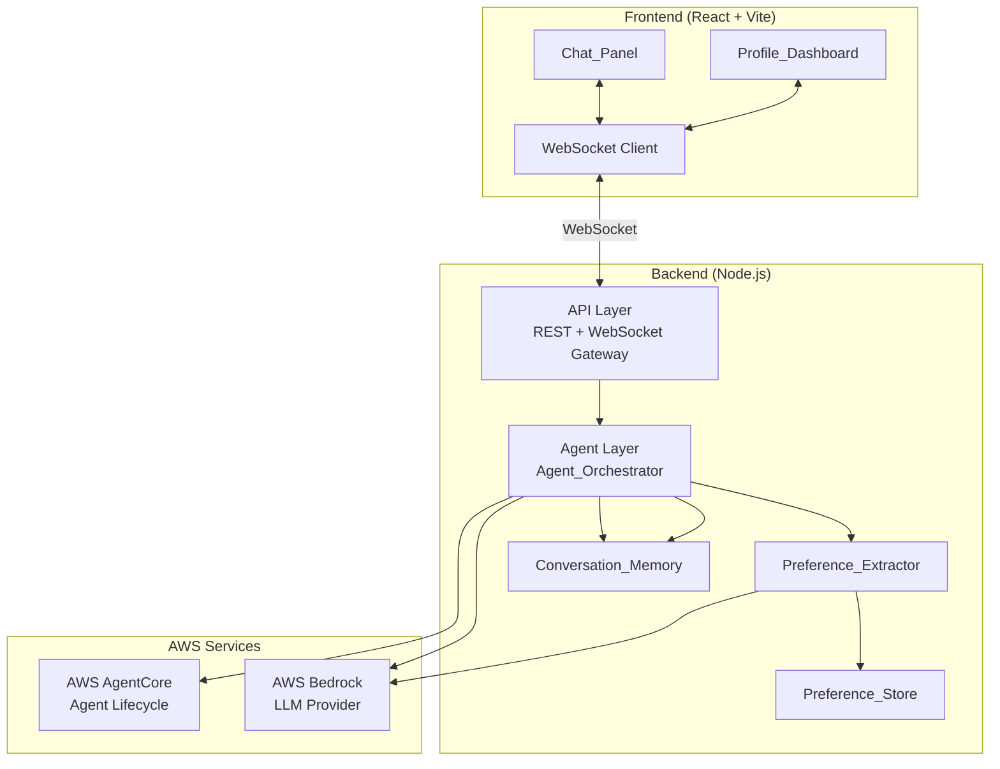
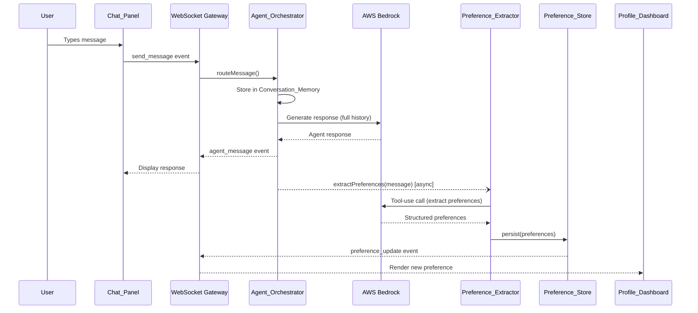
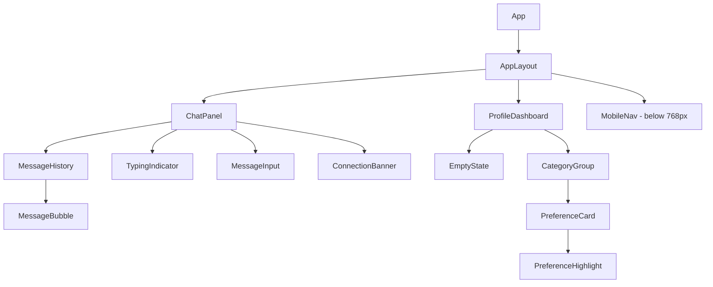
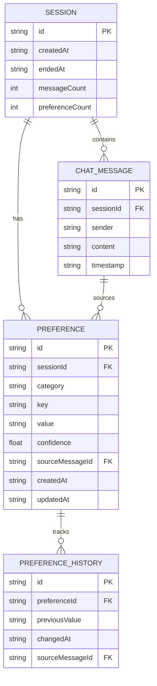

# Design Document — Valentin the Romantic Agent

## Overview

Valentin is a conversational AI agent that helps users build a structured knowledge base of their spouse's preferences through natural dialogue. The system is a Phase 1 POC consisting of a React frontend with a dual-panel layout (Chat_Panel + Profile_Dashboard), a modular Node.js/TypeScript backend, and AWS cloud services (Bedrock for LLM, AgentCore for orchestration).

The user chats with Valentin in the left panel. Behind the scenes, a Preference_Extractor pipeline analyzes each message, extracts structured preference data, and pushes updates to the right panel in real time via WebSocket. The architecture is designed for future extensibility — a protocol-agnostic event interface supports adding a Telegram bot client, and an abstract storage interface allows migrating from in-memory/session storage to a database.

All code is TypeScript in strict mode. The frontend uses React + Vite; the backend is a Node.js server exposing both REST and WebSocket endpoints.

## Architecture

### High-Level System Diagram



### Layer Responsibilities

| Layer | Module | Responsibility |
|-------|--------|----------------|
| API | `src/server/api/` | HTTP endpoints, WebSocket gateway, request validation, event routing |
| Agent | `src/server/agent/` | AgentCore integration, Bedrock prompts, conversation flow, tool orchestration |
| Extraction | `src/server/extraction/` | Preference extraction pipeline, Bedrock tool-use calls, category mapping |
| Persistence | `src/server/persistence/` | Abstract storage interface, in-memory implementation, conversation memory |
| Frontend | `src/client/` | React app, components, hooks, WebSocket client, state management |
| Shared | `src/shared/` | Interfaces, types, constants, validation utilities shared across layers |

### Data Flow



## Components and Interfaces

### Frontend Component Hierarchy



### Key Frontend Interfaces

```typescript
// src/shared/interfaces/message.ts
interface ChatMessage {
  id: string;
  sessionId: string;
  sender: 'user' | 'agent';
  content: string;
  timestamp: string; // ISO 8601
}

// src/shared/interfaces/preference.ts
interface Preference {
  id: string;
  sessionId: string;
  category: PreferenceCategory;
  key: string;
  value: string;
  confidence: number; // 0.0 – 1.0
  sourceMessageId: string;
  createdAt: string;
  updatedAt: string;
}

interface PreferenceHistoryEntry {
  previousValue: string;
  changedAt: string;
  sourceMessageId: string;
}

interface PreferenceWithHistory extends Preference {
  history: PreferenceHistoryEntry[];
}

type PreferenceCategory =
  | 'food'
  | 'hobbies'
  | 'music'
  | 'travel'
  | 'gifts'
  | 'love_language'
  | 'important_dates'
  | 'personality_traits';
```

### WebSocket Event Protocol

The WebSocket gateway uses a typed event protocol. Each message is a JSON envelope:

```typescript
// src/shared/interfaces/ws-events.ts
interface WsEnvelope<T extends string, P> {
  type: T;
  payload: P;
  timestamp: string;
}

// Client → Server events
type ClientEvent =
  | WsEnvelope<'send_message', { sessionId: string; content: string }>
  | WsEnvelope<'ping', {}>;

// Server → Client events
type ServerEvent =
  | WsEnvelope<'agent_message', { message: ChatMessage }>
  | WsEnvelope<'typing_start', { sessionId: string }>
  | WsEnvelope<'typing_stop', { sessionId: string }>
  | WsEnvelope<'preference_update', { preference: PreferenceWithHistory; isNew: boolean }>
  | WsEnvelope<'connection_status', { status: 'connected' | 'reconnecting' | 'disconnected' }>
  | WsEnvelope<'session_init', { sessionId: string; welcomeMessage: ChatMessage }>
  | WsEnvelope<'error', { code: string; message: string }>
  | WsEnvelope<'pong', {}>;
```

This protocol is transport-agnostic — a future Telegram bot adapter can subscribe to the same `ServerEvent` stream and translate events into Telegram API calls.

### Backend Service Interfaces

```typescript
// src/server/agent/agent-orchestrator.ts
interface AgentOrchestrator {
  handleMessage(sessionId: string, content: string): Promise<ChatMessage>;
  initSession(): Promise<{ sessionId: string; welcomeMessage: ChatMessage }>;
}

// src/server/extraction/preference-extractor.ts
interface PreferenceExtractor {
  extract(message: ChatMessage, history: ChatMessage[]): Promise<ExtractedPreference[]>;
}

interface ExtractedPreference {
  category: PreferenceCategory;
  key: string;
  value: string;
  confidence: number;
}

// src/server/persistence/storage-interface.ts
interface StorageInterface {
  // Preferences
  savePreference(pref: Preference): Promise<void>;
  updatePreference(id: string, update: Partial<Preference>): Promise<PreferenceWithHistory>;
  getPreferencesBySession(sessionId: string): Promise<PreferenceWithHistory[]>;
  findPreference(sessionId: string, category: PreferenceCategory, key: string): Promise<PreferenceWithHistory | null>;

  // Conversation Memory
  saveMessage(msg: ChatMessage): Promise<void>;
  getMessagesBySession(sessionId: string): Promise<ChatMessage[]>;

  // Session
  createSession(): Promise<string>;
  getSession(sessionId: string): Promise<SessionData | null>;
  endSession(sessionId: string): Promise<void>;
}

interface SessionData {
  id: string;
  createdAt: string;
  endedAt: string | null;
  messageCount: number;
  preferenceCount: number;
}
```

### Bedrock Integration

The Agent_Orchestrator uses two distinct Bedrock interactions:

1. **Conversation generation** — Standard message API with the full conversation history as context. The system prompt defines Valentin's personality (warm, sophisticated, curious about the user's spouse). Uses `anthropic.claude-3-sonnet` or equivalent model.

2. **Preference extraction** — Tool-use API call where Bedrock is given a message + recent context and asked to extract structured preferences using a defined tool schema. This runs asynchronously after the conversation response is sent.

```typescript
// Bedrock tool schema for preference extraction
const extractPreferencesTool = {
  name: 'extract_preferences',
  description: 'Extract spouse preferences from the conversation message',
  input_schema: {
    type: 'object',
    properties: {
      preferences: {
        type: 'array',
        items: {
          type: 'object',
          properties: {
            category: { type: 'string', enum: PREFERENCE_CATEGORIES },
            key: { type: 'string', description: 'Short label for the preference' },
            value: { type: 'string', description: 'The preference value' },
            confidence: { type: 'number', minimum: 0, maximum: 1 }
          },
          required: ['category', 'key', 'value', 'confidence']
        }
      }
    },
    required: ['preferences']
  }
};
```

### AgentCore Integration

AWS AgentCore manages the agent lifecycle:

- **Agent registration** — On server startup, register the Valentin agent with AgentCore, defining its capabilities and tool set.
- **Session binding** — Each user session maps to an AgentCore session, providing built-in conversation tracking.
- **Tool orchestration** — AgentCore routes tool invocations (preference extraction) and manages retries/timeouts.

The orchestrator wraps AgentCore's SDK, keeping the rest of the backend decoupled from the specific orchestration provider.

### Conversation Memory & Context Window Management

```typescript
// src/server/persistence/conversation-memory.ts
interface ConversationMemory {
  addMessage(sessionId: string, message: ChatMessage): Promise<void>;
  getHistory(sessionId: string): Promise<ChatMessage[]>;
  getContextWindow(sessionId: string, maxTokens: number): Promise<ContextWindow>;
}

interface ContextWindow {
  summary: string | null;       // Summary of older messages (if truncated)
  recentMessages: ChatMessage[]; // Recent messages within token budget
  totalMessages: number;
}
```

When the conversation history exceeds the LLM context window (~180k tokens for Claude), the system:
1. Estimates token count of the full history
2. If over budget, takes the oldest N messages and summarizes them via a Bedrock call
3. Stores the summary and sends `[summary] + [recent messages]` as context

### State Management (Frontend)

The frontend uses React Context + `useReducer` for predictable state transitions:

```typescript
// src/client/hooks/use-chat-state.ts
interface ChatState {
  sessionId: string | null;
  messages: ChatMessage[];
  isTyping: boolean;
  connectionStatus: 'connected' | 'reconnecting' | 'disconnected';
  inputValue: string;
}

type ChatAction =
  | { type: 'SESSION_INIT'; sessionId: string; welcomeMessage: ChatMessage }
  | { type: 'SEND_MESSAGE'; message: ChatMessage }
  | { type: 'RECEIVE_MESSAGE'; message: ChatMessage }
  | { type: 'SET_TYPING'; isTyping: boolean }
  | { type: 'SET_CONNECTION'; status: ChatState['connectionStatus'] }
  | { type: 'SET_INPUT'; value: string }
  | { type: 'CLEAR_INPUT' };

// src/client/hooks/use-preferences-state.ts
interface PreferencesState {
  preferences: Record<PreferenceCategory, PreferenceWithHistory[]>;
  recentlyUpdated: Set<string>; // preference IDs with active highlight
}

type PreferencesAction =
  | { type: 'ADD_PREFERENCE'; preference: PreferenceWithHistory }
  | { type: 'UPDATE_PREFERENCE'; preference: PreferenceWithHistory }
  | { type: 'CLEAR_HIGHLIGHT'; preferenceId: string };
```

### WebSocket Client (Frontend)

```typescript
// src/client/hooks/use-websocket.ts
interface UseWebSocketReturn {
  sendMessage: (content: string) => void;
  connectionStatus: 'connected' | 'reconnecting' | 'disconnected';
  lastError: string | null;
}
```

The hook manages:
- Auto-connect on mount
- Auto-reconnect with exponential backoff (1s, 2s, 4s, max 30s)
- Event dispatching to chat and preferences reducers
- Ping/pong heartbeat every 30s

## Data Models

### Entity Relationship Diagram



### Preference Categories

| Category | Description | Example Keys |
|----------|-------------|-------------|
| `food` | Dietary preferences, favorite cuisines, restaurants | `favorite_cuisine`, `dietary_restriction`, `comfort_food` |
| `hobbies` | Activities, sports, creative pursuits | `main_hobby`, `weekend_activity`, `sport` |
| `music` | Genres, artists, concert preferences | `favorite_genre`, `favorite_artist`, `concert_preference` |
| `travel` | Destinations, travel style, bucket list | `dream_destination`, `travel_style`, `visited_favorite` |
| `gifts` | Gift preferences, wish list items, price range | `gift_style`, `wish_list_item`, `avoids` |
| `love_language` | How they express/receive love | `primary_language`, `secondary_language`, `gesture_preference` |
| `important_dates` | Birthdays, anniversaries, milestones | `birthday`, `anniversary`, `special_date` |
| `personality_traits` | Temperament, social style, values | `introvert_extrovert`, `morning_night`, `core_value` |

### File/Folder Structure

```
src/
├── client/                          # Frontend (React)
│   ├── components/
│   │   ├── AppLayout.tsx
│   │   ├── ChatPanel.tsx
│   │   ├── MessageHistory.tsx
│   │   ├── MessageBubble.tsx
│   │   ├── MessageInput.tsx
│   │   ├── TypingIndicator.tsx
│   │   ├── ConnectionBanner.tsx
│   │   ├── ProfileDashboard.tsx
│   │   ├── CategoryGroup.tsx
│   │   ├── PreferenceCard.tsx
│   │   ├── PreferenceHighlight.tsx
│   │   ├── EmptyState.tsx
│   │   └── MobileNav.tsx
│   ├── hooks/
│   │   ├── use-chat-state.ts
│   │   ├── use-preferences-state.ts
│   │   └── use-websocket.ts
│   ├── context/
│   │   ├── chat-context.tsx
│   │   └── preferences-context.tsx
│   ├── design-system/
│   │   ├── tokens.ts
│   │   └── global-styles.ts
│   ├── App.tsx
│   └── main.tsx
├── server/                          # Backend (Node.js)
│   ├── api/
│   │   ├── ws-gateway.ts
│   │   ├── http-routes.ts
│   │   └── event-router.ts
│   ├── agent/
│   │   ├── agent-orchestrator.ts
│   │   ├── bedrock-client.ts
│   │   ├── prompts.ts
│   │   └── agentcore-adapter.ts
│   ├── extraction/
│   │   ├── preference-extractor.ts
│   │   └── category-mapper.ts
│   ├── persistence/
│   │   ├── storage-interface.ts
│   │   ├── in-memory-store.ts
│   │   └── conversation-memory.ts
│   └── index.ts
├── shared/                          # Shared types & utilities
│   ├── interfaces/
│   │   ├── message.ts
│   │   ├── preference.ts
│   │   ├── session.ts
│   │   └── ws-events.ts
│   ├── constants/
│   │   └── categories.ts
│   ├── validation/
│   │   └── message-validator.ts
│   └── index.ts
e2e/
├── tests/
│   └── onboarding-flow.spec.ts
├── fixtures/
│   └── page-objects.ts
└── playwright.config.ts
```


## Correctness Properties

*A property is a characteristic or behavior that should hold true across all valid executions of a system — essentially, a formal statement about what the system should do. Properties serve as the bridge between human-readable specifications and machine-verifiable correctness guarantees.*

### Property 1: Message submission adds to conversation

*For any* valid (non-empty) message string and any current message list, submitting the message should result in the message list growing by exactly one, and the new entry should have `sender: 'user'` and `content` equal to the submitted string.

**Validates: Requirements 1.2**

### Property 2: Messages display in chronological order

*For any* sequence of ChatMessage objects with arbitrary timestamps, the rendered message list should always be sorted in ascending chronological order by timestamp.

**Validates: Requirements 1.3**

### Property 3: Typing indicator reflects agent processing state

*For any* ChatState where `isTyping` is true, the typing indicator component should be visible. *For any* ChatState where `isTyping` is false, the typing indicator should not be visible.

**Validates: Requirements 1.4**

### Property 4: Input cleared after message submission

*For any* non-empty input value, after dispatching a SEND_MESSAGE action, the resulting state should have an empty `inputValue`.

**Validates: Requirements 1.5**

### Property 5: Message persistence round trip

*For any* ChatMessage, storing it via `saveMessage` and then retrieving messages via `getMessagesBySession` should return a list containing a message with identical `id`, `content`, `sender`, and `timestamp`. Furthermore, *for any* session with N stored messages, `getMessagesBySession` should return exactly N messages.

**Validates: Requirements 3.1, 3.2, 3.4**

### Property 6: Preference persistence with valid structure

*For any* ExtractedPreference persisted to the store, the resulting Preference record must contain a non-empty `id`, a `category` that is one of the defined PreferenceCategory enum values, a non-empty `key`, a non-empty `value`, and a `confidence` score between 0.0 and 1.0 inclusive.

**Validates: Requirements 2.2, 2.4**

### Property 7: Preference update retains history

*For any* existing Preference that is updated with a new value, the resulting PreferenceWithHistory should contain a `history` array where the most recent entry has `previousValue` equal to the old value and a valid `changedAt` timestamp. The history array length should equal the number of updates performed.

**Validates: Requirements 2.3**

### Property 8: Context window stays within token budget

*For any* conversation history and any positive `maxTokens` budget, `getContextWindow` should return a ContextWindow where the estimated token count of `summary` (if present) plus `recentMessages` does not exceed `maxTokens`. If the full history fits within budget, `summary` should be null and all messages should be in `recentMessages`.

**Validates: Requirements 3.6**

### Property 9: Preferences grouped by category with correct counts

*For any* set of PreferenceWithHistory objects, the ProfileDashboard should render one CategoryGroup per distinct category present, and each CategoryGroup's displayed item count should equal the number of preferences in that category.

**Validates: Requirements 4.3, 4.4**

### Property 10: Updated preferences show highlight

*For any* preference update event received by the ProfileDashboard (where `isNew` is false), the corresponding PreferenceCard should have an active highlight state. After the highlight animation duration elapses, the highlight should be cleared.

**Validates: Requirements 4.6**

### Property 11: Design token constraints

*For any* spacing token in the Design_System, its numeric value should be a positive multiple of 8. *For any* animation duration token, its value should be between 200ms and 400ms inclusive.

**Validates: Requirements 5.3, 5.7**

### Property 12: Message styling differs by sender

*For any* ChatMessage, the MessageBubble component should apply a distinct CSS class or style based on the `sender` field. Specifically, the class/style applied when `sender === 'agent'` must differ from when `sender === 'user'`.

**Validates: Requirements 5.4**

## Error Handling

### Error Classification

| Error Type | Class | Handling Strategy |
|-----------|-------|-------------------|
| WebSocket disconnect | `ConnectionError` | Auto-reconnect with exponential backoff; show banner in UI |
| Bedrock API failure (conversation) | `LlmError` | Retry once; if still failing, show user-friendly error in chat |
| Bedrock API failure (extraction) | `ExtractionError` | Log with message ID; do not interrupt conversation (Req 2.6) |
| Invalid message (empty/whitespace) | `ValidationError` | Reject at client before sending; show inline validation hint |
| Session not found | `SessionError` | Create new session automatically; log warning |
| Storage write failure | `StorageError` | Log error; retry once; if persistent, degrade gracefully |
| Context window overflow | `ContextError` | Trigger summarization pipeline; never send over-budget prompt |

### Custom Error Classes

```typescript
// src/shared/errors/base-error.ts
abstract class AppError extends Error {
  abstract readonly code: string;
  abstract readonly statusCode: number;
  readonly context: Record<string, unknown>;

  constructor(message: string, context: Record<string, unknown> = {}) {
    super(message);
    this.name = this.constructor.name;
    this.context = context;
  }
}

// src/shared/errors/connection-error.ts
class ConnectionError extends AppError {
  readonly code = 'CONNECTION_ERROR';
  readonly statusCode = 503;
}

// src/shared/errors/llm-error.ts
class LlmError extends AppError {
  readonly code = 'LLM_ERROR';
  readonly statusCode = 502;
}

// src/shared/errors/extraction-error.ts
class ExtractionError extends AppError {
  readonly code = 'EXTRACTION_ERROR';
  readonly statusCode = 500;
}

// src/shared/errors/validation-error.ts
class ValidationError extends AppError {
  readonly code = 'VALIDATION_ERROR';
  readonly statusCode = 400;
}
```

### Frontend Error Boundaries

- A top-level React Error Boundary wraps the App to catch unhandled render errors and display a recovery UI.
- The WebSocket hook surfaces connection errors via `connectionStatus` state, which the ConnectionBanner component consumes.
- Chat errors (LLM failures) are displayed as system messages in the chat thread, not as modal dialogs, to maintain conversational flow.

### Backend Error Logging

All errors are logged with structured context:
```typescript
logger.error('Preference extraction failed', {
  code: error.code,
  messageId: message.id,
  sessionId: message.sessionId,
  stack: error.stack,
});
```

## Testing Strategy

### Dual Testing Approach

This project uses both unit/component tests and property-based tests for comprehensive coverage:

- **Unit tests** verify specific examples, edge cases, and error conditions
- **Property-based tests** verify universal properties across randomly generated inputs
- Together they provide both concrete bug detection and general correctness guarantees

### Test Stack

| Tool | Purpose |
|------|---------|
| Vitest | Test runner for unit and property tests |
| React Testing Library | Component rendering and interaction testing |
| @testing-library/user-event | User interaction simulation |
| fast-check | Property-based testing library for TypeScript |
| Playwright | End-to-end browser testing |

### Property-Based Testing Configuration

- Library: **fast-check** (TypeScript-native PBT library, integrates with Vitest)
- Each property test runs a minimum of **100 iterations**
- Each property test includes a comment tag referencing the design property:
  ```typescript
  // Feature: valentin-romantic-agent, Property 5: Message persistence round trip
  ```
- Each correctness property from this design document is implemented by a **single** property-based test

### Test Distribution by Agent

**🏗️ System Architect — Shared utilities & data models**
- Unit tests: validation utilities, constant exports, type guards
- Property tests: Property 5 (message persistence round trip), Property 6 (preference structure validation), Property 7 (preference history retention), Property 8 (context window budget)

**⚛️ Frontend Dev — React components & hooks**
- Component tests: all components render without crashing, user interactions, accessibility
- Property tests: Property 1 (message submission), Property 2 (chronological order), Property 3 (typing indicator), Property 4 (input cleared), Property 9 (category grouping), Property 10 (highlight on update), Property 12 (sender styling)
- Unit tests: reducer state transitions, WebSocket hook reconnection logic

**🔧 Backend Dev — API, services, Bedrock/AgentCore**
- Unit tests: API endpoint responses, service business logic, error handling
- Property tests: Property 5 (message persistence — backend implementation), Property 6 (preference structure), Property 7 (preference history), Property 8 (context window)
- Integration tests: Bedrock client with mocked responses, WebSocket gateway event routing

**🎨 UI Designer — Design system**
- Unit tests: token exports exist, values are valid
- Property tests: Property 11 (design token constraints — spacing multiples of 8, animation durations)

**🧪 QA Agent — E2E**
- Playwright tests: full onboarding flow (open → chat → receive response → see preference), responsive layout toggle, connection loss recovery
- Cross-browser: Chromium, Firefox, WebKit

### Test File Locations

- Unit/property tests: colocated as `<name>.test.ts` or in `__tests__/` directories
- E2E tests: `e2e/tests/` organized by feature
- Page objects: `e2e/fixtures/`

### CI Pipeline

```
npm run lint          # tsc --noEmit
npm test -- --run     # Vitest (unit + property tests)
npx playwright test   # E2E tests
npm run build         # Production build verification
```
