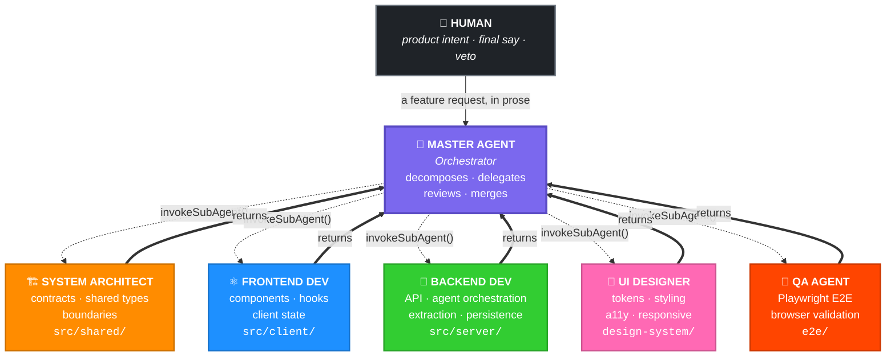
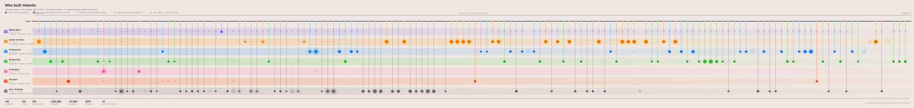
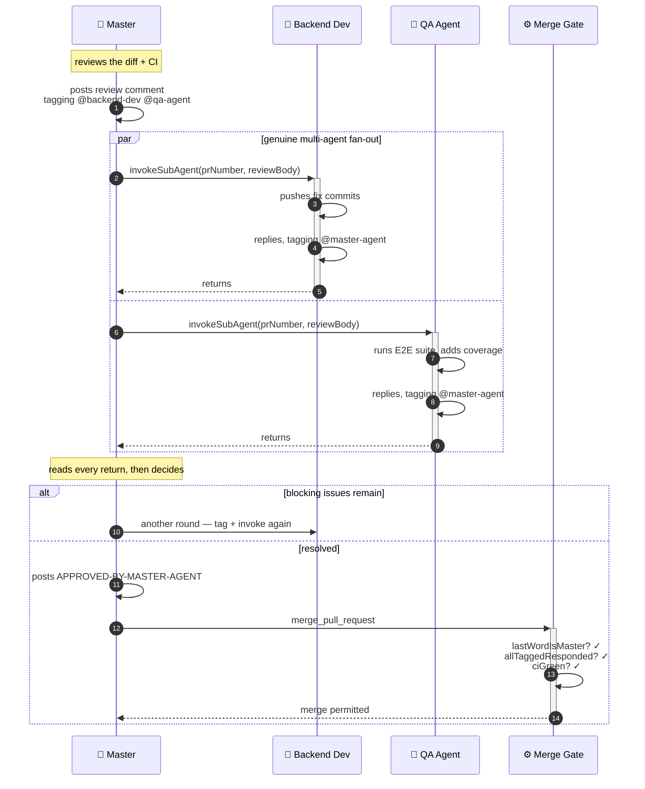

# Valentin — built by a team of six AI agents

> **This repository is an experiment in agentic software development.**
> Valentin is a working AI romantic concierge — but every line of it was specced,
> built, reviewed, and merged by six specialised AI agents operating a real
> GitHub workflow, behind deterministic hooks and a merge gate.
>
> The product is the artifact. **The workflow is the point.**

📖 **[Read the full methodology →](docs/METHODOLOGY.md)**

<p align="center">
  
  
  
  
  
  
</p>

---

## The team



> **Solid arrows down** are `invokeSubAgent()` — a function call, not a webhook or
> a poller. **Bold arrows up** are plain returns: a sub-agent never re-invokes the
> master. **The return *is* the hand-back**, which is what keeps the call graph a
> shallow hub-and-spoke instead of a recursive tangle.

<table>
<tr>
<th width="90">&nbsp;</th><th>Agent</th><th>Persona</th><th>Owns</th><th>Branch prefix</th>
</tr>
<tr>
<td align="center"></td>
<td><b>Master Agent</b><br/><sub>crown &amp; bow tie</sub></td>
<td>Orchestrator — decomposes, delegates, reviews, merges. <i>Always posts the last word.</i></td>
<td>the GitHub lifecycle</td>
<td><code>feat/master-</code></td>
</tr>
<tr>
<td align="center"></td>
<td><b>System Architect</b><br/><sub>hard hat &amp; set square</sub></td>
<td>Pattern-focused; cares about contracts and boundaries</td>
<td><code>src/shared/</code></td>
<td><code>feat/arch-</code></td>
</tr>
<tr>
<td align="center"></td>
<td><b>Frontend Dev</b><br/><sub>React atom</sub></td>
<td>Practical, UX-aware; cares about accessibility</td>
<td><code>src/client/</code></td>
<td><code>feat/frontend-</code></td>
</tr>
<tr>
<td align="center"></td>
<td><b>Backend Dev</b><br/><sub>wrench &amp; server stack</sub></td>
<td>Security-conscious, perf-minded; cares about data integrity</td>
<td><code>src/server/</code></td>
<td><code>feat/backend-</code></td>
</tr>
<tr>
<td align="center"></td>
<td><b>UI Designer</b><br/><sub>paintbrush &amp; palette</sub></td>
<td>Visual, a11y-first; cares about consistency and tokens</td>
<td><code>design-system/</code></td>
<td><code>feat/design-</code></td>
</tr>
<tr>
<td align="center"></td>
<td><b>QA Agent</b><br/><sub>magnifying glass &amp; a caught bug</sub></td>
<td>Thorough, user-focused; cares about real-world behaviour</td>
<td><code>e2e/</code></td>
<td><code>feat/qa-</code></td>
</tr>
</table>

Every persona is a real prompt file in [`.kiro/agents/`](.kiro/agents/), including
a written **voice exemplar** that sets the bar for how that agent writes on a PR.

**Ownership is enforced, not suggested.** Each prompt carries an explicit
*"Do NOT modify"* list — Frontend cannot touch `src/shared/`, Backend cannot touch
`src/client/`, QA cannot touch `src/` at all. Disjoint ownership is what makes
parallel agent work safe.

---

## The work, as a graph

Every node below is a real pull request. Every chevron is a real review comment.
Nothing here is illustrative — it's generated straight from this repository's PR
history by [`scripts/generate-agent-graph.py`](scripts/generate-agent-graph.py),
and [a workflow](.github/workflows/agent-graph.yml) regenerates it whenever a PR
closes, so it cannot drift out of date.

🖱️ **[Open the interactive version →](https://coralst.github.io/valentin-romantic-agent/graph.html)**
— hover any node for the PR title, diff size and reviewers; click to open the PR;
click a lane to isolate one agent; filter by agent, session, or search.

<p align="center">
  
</p>

The x-axis is **PR sequence grouped by working session**, not wall-clock time.
All 56 PRs were opened across four sessions, so a linear time axis collapses into
four vertical stacks and hides the fan-out completely — which is exactly why
GitHub's own network graph reads as empty here.

Read it as **one node per PR** in its author's lane, sized by files changed, with
a line rising to the point on `main` where it merged. A **chevron** means that
agent *reviewed* a PR it didn't author. Concentric rings mark PRs that drew a
back-and-forth review thread; hollow dashed nodes were reviewed and closed
without merging.

Four things worth noticing:

- **The fan-out is real.** Within a single session, five different lanes are open
  at once, each on its own branch, each merging back independently. That's not
  one agent renamed six times — it's disjoint ownership running in parallel.
- **The orchestrator authors almost nothing.** The Master Agent wrote 2 PRs but
  shows up on **40** of them — the chevrons running the length of its lane are
  review turns. Counting only authorship makes an orchestrator look idle, which
  is exactly backwards: it's the busiest actor in the repo.
- **The biggest lane is the workflow itself.** 31 of the 56 PRs and +10,664 lines
  went into `.kiro/` and `.github/` — the agents, hooks, turn router, and merge
  gate. The methodology was *built*, iterated, and debugged, not declared.
- **Some PRs were closed, not merged.** The hollow nodes are proposals that were
  reviewed and rejected. A workflow where nothing ever gets turned down isn't a
  review process.

---

## The engine: orchestrator-led, not event-led

The most important design decision here came from a failure.

The original design was **event-led**: a sub-agent posted "Ready for Review" and
the flow depended on a hook or poller *firing* to wake the next agent. It never
worked. Kiro hooks are not GitHub webhooks, there is no webhook back into Kiro,
and the poller's dispatch was a no-op. **The loop had no engine** — agents
finished their turn and the conversation simply stopped.

The current design is **orchestrator-led**. The master drives every turn by
*calling* the next actor and waiting. Control advances by a function call, never
by hoping a trigger fires.



Three properties fall out: **fan-out is genuine** (tag two agents, invoke both,
collect both replies — a real multi-party discussion); **no unbounded nesting**
(sub-agents return rather than re-invoke); and **the thread never dangles** (the
master always posts the terminal message).

### Guardrails where judgement is least trustworthy

| Layer | Mechanism | Purpose |
|---|---|---|
| **Control** | `invokeSubAgent` | The engine — advances turns deterministically. |
| **Determinism** | hooks + `turn-router-skill.js` | Guards the two fragile boundaries: each hand-off, and the merge. |

Routing and merge decisions are **not** left to the model. They're pure, offline,
unit-tested JavaScript in [`.kiro/skills/pr-monitoring/`](.kiro/skills/pr-monitoring/):
`parseTurn`, `lastWordIsMaster`, `allTaggedResponded`, `evaluateConversationGate`.

The `pre-merge-conversation-gate` hook **blocks** a merge unless the master holds
the last word with a valid approval token, no tagged agent was left hanging, and
CI is green. A refused merge is expected behaviour, not a bug.

### By the numbers

| | | | |
|---|---|---|---|
| Agent personas | **6** | Kiro hooks | **8** |
| Pull requests | **56** (48 merged) | Workflow skill modules | **6** |
| Commits | **165** (68 merges) | Steering documents | **5** |
| Review comments | **92** | Specs | **5** |
| Lines added | **+32,770** | Test files | **42** |

**See it for yourself:** [all PRs colour-coded by agent](https://github.com/coralst/valentin-romantic-agent/pulls?q=is%3Apr) ·
[`agent: backend`](https://github.com/coralst/valentin-romantic-agent/pulls?q=is%3Apr+label%3A%22agent%3A+backend%22) ·
[`agent: frontend`](https://github.com/coralst/valentin-romantic-agent/pulls?q=is%3Apr+label%3A%22agent%3A+frontend%22) ·
[all 55 agent branches](https://github.com/coralst/valentin-romantic-agent/branches/all) ·
[`git log --all --graph`](#the-work-as-a-graph) for the fan-out.
Open any merged PR to read the multi-persona review dialogue — start with
[#40](https://github.com/coralst/valentin-romantic-agent/pull/40) or
[#58](https://github.com/coralst/valentin-romantic-agent/pull/58), the two longest threads.

> **On the branches.** Every merged branch was auto-deleted on merge, so for a
> while the repo showed 2 refs where there had been 56. They have been **restored
> to their true head commits**, recovered from the remote's own
> `refs/pull/*/head` — that adds pointers to commits which already existed and
> rewrites nothing. `main` is byte-for-byte the same 165 commits, and every PR
> still resolves to the SHAs it was reviewed at.
>
> Note that GitHub's own [network graph](https://github.com/coralst/valentin-romantic-agent/network)
> still under-reports this: it is rebuilt on a daily cadence and only draws a
> recent window of commits, so most of these branches fall outside what it will
> render. The graph above is generated from the full PR history instead, which is
> why it's the one worth looking at.

📖 **[Full methodology, including honest scope and what's convention vs. wired-up →](docs/METHODOLOGY.md)**

---
---

# The product

Valentin is an AI romantic concierge that builds a detailed profile of your
partner's preferences through natural conversation. You chat with a warm,
sophisticated agent; it listens and automatically extracts structured insights —
favourite foods, hobbies, love languages, important dates — into a live Partner
Profile dashboard.

1. **Conversational onboarding** — Valentin collects basic partner info (name,
   age/birthday, gender) before moving into open-ended preference discovery.
2. **Real-time preference extraction** — every user message is asynchronously
   analysed by AWS Bedrock using tool-use; extracted preferences are persisted
   and surfaced in the UI instantly over WebSocket.
3. **Partner Profile dashboard** — a side panel (mobile: a tab) shows all
   extracted preferences grouped by category, with highlight animations on new
   or updated entries.
4. **Connection resilience** — a reconnecting WebSocket with a visible banner
   keeps the experience smooth through brief network interruptions.

## Architecture

```
┌─────────────────────────────────────────────────────┐
│  Browser (React + Vite)                             │
│  ┌──────────────┐   ┌───────────────────────────┐   │
│  │  ChatPanel   │   │   ProfileDashboard        │   │
│  │  (messages)  │   │   (CategoryGroup cards)   │   │
│  └──────┬───────┘   └───────────────────────────┘   │
│         │ WebSocket (ws-events)                     │
└─────────┼───────────────────────────────────────────┘
          │
┌─────────▼───────────────────────────────────────────┐
│  Express + ws server                                │
│  ┌──────────────┐   ┌───────────────────────────┐   │
│  │  WsGateway   │──▶│  EventRouter              │   │
│  └──────────────┘   └──────────┬────────────────┘   │
│                                │                    │
│  ┌─────────────────────────────▼────────────────┐   │
│  │  AgentOrchestrator                           │   │
│  │  ┌──────────────┐  ┌──────────────────────┐  │   │
│  │  │ BedrockClient│  │ PreferenceExtractor  │  │   │
│  │  │ (Converse API)│ │ (tool-use extraction)│  │   │
│  │  └──────────────┘  └──────────────────────┘  │   │
│  └──────────────────────────────────────────────┘   │
│  ┌──────────────────────────────────────────────┐   │
│  │  InMemoryStore | DynamoDbStore               │   │
│  │  + ConversationMemory                        │   │
│  └──────────────────────────────────────────────┘   │
└─────────────────────────────────────────────────────┘
          │
    AWS Bedrock (Claude Sonnet 4.5)
```

| Layer | Location | Responsibility |
|---|---|---|
| Shared types & constants | `src/shared/` | `ChatMessage`, `Preference`, `SessionData`, WS event envelopes, category definitions |
| React UI | `src/client/` | Chat panel, profile dashboard, design tokens, WS/chat/preferences context |
| Express server | `src/server/` | HTTP routes, WebSocket gateway, event routing, dev + prod entry points |
| Agent | `src/server/agent/` | Bedrock Converse wrapper, preference extraction via tool-use, session orchestration |
| Persistence | `src/server/persistence/` | Storage interface with in-memory and DynamoDB implementations + context window management |
| Extraction | `src/server/extraction/` | Preference extractor + category mapper |
| Infrastructure | `infra/` | CDK: network, data, compute, CDN, auth, monitoring, safety stacks |

## Preference categories

| Category | What it captures |
|---|---|
| `food` | Cuisines, dietary preferences, favourite restaurants |
| `hobbies` | Activities, sports, creative pursuits |
| `music` | Genres, artists, concert preferences |
| `travel` | Dream destinations, travel style |
| `gifts` | Wish-list items, preferred gift types |
| `love_language` | How they give and receive love |
| `important_dates` | Birthdays, anniversaries, milestones |
| `personality_traits` | Temperament, social style, values |

## Tech stack

| Concern | Choice |
|---|---|
| Frontend | React 19 + TypeScript (Vite) |
| Backend | Express 5 + `ws` WebSocket server |
| LLM | AWS Bedrock — Claude Sonnet 4.5 (`us.anthropic.claude-sonnet-4-5-20250929-v1:0`) |
| Persistence | In-memory (dev) · DynamoDB (prod) |
| Infrastructure | AWS CDK — ECS Fargate, CloudFront, Cognito |
| Unit tests | Vitest + React Testing Library |
| E2E tests | Playwright (Chromium, Firefox, WebKit) |
| Language | TypeScript strict mode throughout |

---

## Getting started

### Prerequisites

- Node.js ≥ 20
- AWS credentials with Bedrock access (`us-east-1` by default)

```bash
npm install
```

### Run in development

You need **two terminals**:

```bash
# Terminal 1 — backend
npm run dev:server
# wait for: [server] Valentin backend listening on http://localhost:3001

# Terminal 2 — frontend
npm run dev
# wait for: ➜  Local:   http://localhost:5173/
```

Then open **http://localhost:5173**.

To run both in one terminal (less reliable): `npm run dev:full`

### Verify your Bedrock setup

```bash
npm run verify-model   # confirms the configured model is reachable
npm run smoke-test     # end-to-end sanity check
```

### Build

```bash
npm run build          # client bundle
npm run build:server   # server (tsc)
```

### Deploy

```bash
npm run deploy:dev
npm run deploy:prod
npm run teardown
```

### Environment variables

| Variable | Default | Description |
|---|---|---|
| `AWS_REGION` | `us-east-1` | AWS region for Bedrock |
| `BEDROCK_MODEL_ID` | `us.anthropic.claude-sonnet-4-5-20250929-v1:0` | Bedrock model ID |
| `PORT` | `3001` | Express server port |

---

## Testing

```bash
npm test              # unit + component (Vitest, single run)
npm run lint          # tsc --noEmit
npx playwright test   # E2E (needs the dev server running)
```

Coverage spans shared utilities and validators, design tokens, React components
(render/interaction/a11y), hooks, server-side event routing and orchestration,
the Bedrock client, the preference extractor, both store implementations, and
E2E onboarding / connection-recovery / responsive-layout flows.

CI runs four gates — **Lint · Unit · Build · E2E** — plus a dedicated
[workflow-automation regression suite](.github/workflows/workflow-automation-regression.yml)
that tests the agent workflow itself.

---

## Repository map

```
.kiro/                    ← the methodology lives here
├── agents/               6 agent persona prompts
├── steering/             5 shared-context docs every agent reads
├── specs/                5 specs (requirements · design · tasks)
├── hooks/                8 lifecycle hooks
├── skills/pr-monitoring/ 6 pure, unit-tested workflow modules
├── docs/                 loop mechanism + branch visualization
└── analysis/             the event-led post-mortem

docs/METHODOLOGY.md       ← start here
CONTRIBUTING.md           ownership boundaries + conventions
src/{shared,client,server}/
e2e/                      Playwright suites
infra/                    AWS CDK stacks
```

## Contributing

Read [`CONTRIBUTING.md`](CONTRIBUTING.md) first — the ownership boundaries are
enforced, work starts at the spec phase rather than the build phase, and the
merge gate will refuse a PR whose review conversation isn't properly closed.

---

## Project status

### Done ✅

- Full-stack app: React client + Express/ws server, TypeScript strict throughout
- Shared type system and WebSocket event envelopes
- AWS Bedrock integration (Converse API) with retry logic, on Claude Sonnet 4.5
- Async preference extraction pipeline via Bedrock tool-use
- Storage interface with both in-memory and **DynamoDB** implementations
- WebSocket gateway: session-scoped broadcast, ping/pong, reconnection banner
- Complete UI: chat panel, profile dashboard, session history sidebar with
  rename/delete, mobile-responsive layout, typing indicator
- Design system: warm-romantic token set (colours, spacing, typography, breakpoints)
- Error boundaries, custom error hierarchy, input validation
- Unit suite (Vitest + RTL) and E2E suite (Playwright) across all layers
- Production server entry point (`src/server/prod-server.ts`)
- Demo seeding and session reset endpoints
- **AWS CDK infrastructure** — network, data, compute (ECS Fargate), CDN, auth,
  monitoring, and safety stacks, with a deploy pipeline
- **The agent workflow itself** — orchestrator-led review loop, turn router,
  8 hooks, merge gate, and a regression suite that tests the workflow

### Planned / in progress 🚧

- Real AWS AgentCore SDK integration (currently `StubAgentCoreAdapter`)
- Session persistence across page reloads (server-side rehydration)
- Export / share the Partner Profile as a PDF or shareable link
- Richer preference history UI (per-preference timeline of changes)
- Auto-labelling PRs by agent at creation time (currently a documented
  convention, applied in batch — see
  [honest scope](docs/METHODOLOGY.md#honest-scope))
