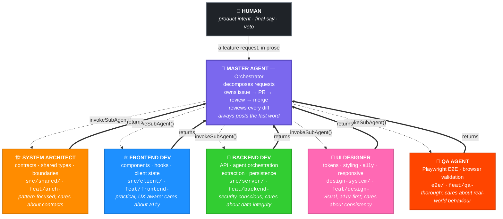
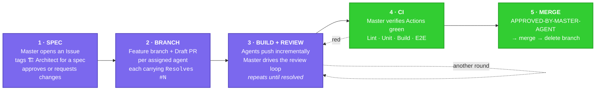
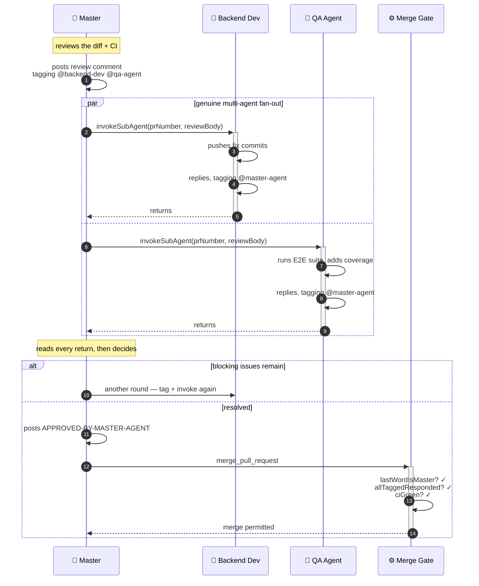

# The Methodology — A Six-Agent Development Team

This repository is two things at once:

1. **A working product** — Valentin, a conversational AI romantic concierge.
2. **A record of how it was built** — by a team of six specialised AI agents that
   spec, implement, review, and merge their own pull requests behind
   deterministic guardrails.

The product is the artifact. The workflow is the point.

---

## The org chart

**Dotted arrows down** are `invokeSubAgent()` — a function call, not a webhook or
a poller. **Bold arrows up** are plain returns. A sub-agent never re-invokes the
master; the return *is* the hand-back, which is what keeps the loop from nesting
without bound.

### The team at a glance

<table>
<tr>
<th width="90">&nbsp;</th><th>Agent</th><th>Persona</th><th>Owns</th><th>Branch prefix</th><th>Label</th>
</tr>
<tr>
<td align="center"></td>
<td><b>Master Agent</b> crown &amp; bow tie</td>
<td>Orchestrator — decomposes, delegates, reviews, merges</td>
<td><code>the GitHub lifecycle</code></td>
<td><code>feat/master-</code></td>
<td><code>agent: master</code></td>
</tr>
<tr>
<td align="center"></td>
<td><b>System Architect</b> hard hat &amp; set square</td>
<td>Technical, pattern-focused; cares about contracts and boundaries</td>
<td><code>src/shared/</code></td>
<td><code>feat/arch-</code></td>
<td><code>agent: architect</code></td>
</tr>
<tr>
<td align="center"></td>
<td><b>Frontend Dev</b> React atom</td>
<td>Practical, UX-aware; cares about accessibility</td>
<td><code>src/client/{components,hooks,context}</code></td>
<td><code>feat/frontend-</code></td>
<td><code>agent: frontend</code></td>
</tr>
<tr>
<td align="center"></td>
<td><b>Backend Dev</b> wrench &amp; server stack</td>
<td>Security-conscious, performance-minded; cares about data integrity</td>
<td><code>src/server/{api,agent,extraction,persistence}</code></td>
<td><code>feat/backend-</code></td>
<td><code>agent: backend</code></td>
</tr>
<tr>
<td align="center"></td>
<td><b>UI Designer</b> paintbrush &amp; palette</td>
<td>Visual, accessibility-focused; cares about consistency and tokens</td>
<td><code>src/client/design-system/</code></td>
<td><code>feat/design-</code></td>
<td><code>agent: design</code></td>
</tr>
<tr>
<td align="center"></td>
<td><b>QA Agent</b> magnifying glass &amp; a caught bug</td>
<td>Thorough, user-focused; cares about real-world behaviour</td>
<td><code>e2e/, playwright.config.ts</code></td>
<td><code>feat/qa-</code></td>
<td><code>agent: qa</code></td>
</tr>
</table>

Each persona lives in a real prompt file under
[`.kiro/agents/`](../.kiro/agents/) — including a written *voice exemplar* that
sets the bar for how that agent writes on a PR.

### Ownership is enforced, not suggested

Every agent prompt carries an explicit **"Do NOT modify"** list. The Frontend Dev
cannot touch `src/shared/`; the Backend Dev cannot touch `src/client/`; QA cannot
touch `src/` at all. The master verifies during review that an agent stayed
inside its boundary.

This is the mechanism that makes parallel agent work safe: disjoint file
ownership means two agents on two branches cannot produce a semantic conflict in
the same file.

---

## The lifecycle

Work moves through five phases, defined in
[`.kiro/steering/git-workflow.md`](../.kiro/steering/git-workflow.md).

Agents push **incrementally**, not in one dump — hook/state logic, then the
first component, then the rest, then wiring, then tests. The commit history is
therefore a readable narrative rather than a single squashed blob.

---

## The engine: orchestrator-led, not event-led

This is the most important design decision in the project, and it came from a
failure.

### What broke

The original design was **event-led**. A sub-agent would finish work and post a
"Ready for Review" comment; the flow then depended on a hook or poller *firing*
to wake the next agent.

It never worked reliably. Kiro hooks are not GitHub webhooks, there is no webhook
back into Kiro, and the poller's dispatch was effectively a no-op. **The loop had
no engine.** Agents finished their turn and the conversation simply stopped,
waiting for a trigger that was never going to arrive.

### What replaced it

The current design is **orchestrator-led**. The master agent drives every turn by
*calling* the next actor and waiting for it to return. Control advances by a
function call — never by hoping a trigger fires.

Three properties fall out of this:

- **Fan-out is genuine.** The master can tag two or more agents in one comment
  (`@backend-dev @qa-agent`) and invoke all of them, collecting every reply
  before its next turn. That produces a real multi-party discussion, not a
  round-robin.
- **No unbounded nesting.** A sub-agent returns rather than re-invoking the
  master, so the call graph is a shallow hub-and-spoke, not a recursive tangle.
- **The thread never dangles.** The master always posts the terminal message.
  No PR conversation ends on a sub-agent's turn.

The `@`-mentions are now the *human-readable transcript* **and** a
machine-parseable routing signal — but they are no longer the (broken) trigger
mechanism.

---

## The determinism layer

Two layers, deliberately separated:

| Layer | Mechanism | Purpose |
|---|---|---|
| **Control** | `invokeSubAgent` in the master prompt | The engine. Advances turns deterministically, no triggers. |
| **Determinism** | tool-use hooks + `turn-router-skill.js` | Guardrails on the two fragile boundaries: each hand-off, and the merge. |

Guardrails matter precisely where LLM judgement is least trustworthy. So the
routing and merge decisions are **not** left to the model — they are pure,
offline, unit-tested JavaScript.

### `turn-router-skill.js`

Pure functions, no network, fully unit-tested
([`.kiro/skills/pr-monitoring/`](../.kiro/skills/pr-monitoring/)):

- `parseTurn(comment)` → `{ author, isMaster, isApproval, nextActors[], unknownMentions[], terminal, valid, problems[] }`.
  `nextActors` is a **list**, which is what makes multi-agent fan-out
  expressible. Flags a **stall** when a non-terminal comment tags nobody.
- `lastWordIsMaster(comments)` — the master must hold the final comment.
- `allTaggedResponded(comments)` — no tagged sub-agent left hanging.
- `evaluateConversationGate({ comments, ciGreen, blockingIssues })` — the merge
  backstop decision.

### The hooks

Eight hooks live in [`.kiro/hooks/`](../.kiro/hooks/). The two that carry the
loop:

- **`route-turn-after-comment`** — `postToolUse` on `add_issue_comment` /
  `create_pull_request_review`. After every comment, routes to the tagged
  agent(s), recognises the terminal master comment, or flags a stall.
- **`pre-merge-conversation-gate`** — `preToolUse` on `merge_pull_request`.
  **Blocks** the merge unless the master has the last word with a valid
  `APPROVED-BY-MASTER-AGENT` token, no tagged agent was left hanging, and CI is
  green.

Hooks gate and prompt; they never write the comment. Prose quality comes from the
voice exemplars in each agent prompt.

### A refused merge is a feature

`evaluateConversationGate` returning `{ mergeable: false, reasons[] }` is
**expected behaviour, not a bug**. Typical reasons:

- the last comment is a sub-agent's — the master has not closed yet
- a tagged sub-agent never replied
- the closing comment lacks a valid approval token
- CI is not green

The corrective turn is always the same: the master ensures every tagged agent has
replied, then posts the closing comment so it holds the last word. Only then is
the merge retried.

---

## A real-world wrinkle: approval in a single-account repo

Every agent here — the master included — acts under the **same GitHub account**.
GitHub blocks a PR author from formally approving their own PR:
`create_pull_request_review` with `event: "APPROVE"` returns
`422 Can not approve your own pull request`.

Attempting a formal approval therefore stalls the merge forever, waiting on
something that can never happen. The workaround is explicit in the master's
prompt: gate the merge on an **approval comment** containing the exact token
`APPROVED-BY-MASTER-AGENT`, and let the branch ruleset enforce quality by
requiring passing CI checks rather than a formal review state.

The token in the comment *is* the approval. The `pre-merge-conversation-gate`
hook is what makes that token trustworthy rather than decorative.

---

## Also in the system

- **Spec-driven development.** Five specs under
  [`.kiro/specs/`](../.kiro/specs/), each with `requirements.md`, `design.md`,
  and `tasks.md`. Implementation follows an approved spec; it does not precede
  one.
- **Steering files.** Five shared-context documents in
  [`.kiro/steering/`](../.kiro/steering/) — architecture, git workflow, project
  conventions, review checklist, testing standards — that every agent reads.
  This is how six agents stay stylistically coherent.
- **Voice exemplars.** Each agent prompt includes a worked example of how that
  persona should write on a PR, explicitly ruling out `✅/❌` scoreboards and
  boilerplate footers in favour of prose that names actual files, commits, and
  trade-offs — *including respectful pushback when the agent disagrees with the
  review*.
- **A self-test regression suite.** The workflow automation tests itself —
  see [`workflow-automation-regression.yml`](../.github/workflows/workflow-automation-regression.yml)
  and the `workflow-regression` tests under `.kiro/specs/`.

---

## Reading the repo as evidence

The methodology is not just described here; it left traces you can inspect:

| What to look at | What it shows |
|---|---|
| [Pull requests](https://github.com/coralst/valentin-romantic-agent/pulls?q=is%3Apr) | 54 PRs, colour-coded by owning agent |
| [`agent: backend`](https://github.com/coralst/valentin-romantic-agent/pulls?q=is%3Apr+label%3A%22agent%3A+backend%22) · [`agent: frontend`](https://github.com/coralst/valentin-romantic-agent/pulls?q=is%3Apr+label%3A%22agent%3A+frontend%22) · [`agent: infra`](https://github.com/coralst/valentin-romantic-agent/pulls?q=is%3Apr+label%3A%22agent%3A+infra%22) | Per-agent workload distribution |
| **Insights → Network** | Parallel agent branches fanning out from `main` and merging back |
| Any merged PR's conversation | The multi-persona review dialogue, hand-off tags, and closing approval token |
| `git log --all --decorate --oneline --graph` | Agent-prefixed branches in the commit graph |

### By the numbers

| | |
|---|---|
| Agent personas | 6 |
| Pull requests | 54 (46 merged) |
| Commits | 157 |
| Specs (`requirements` + `design` + `tasks`) | 5 |
| Kiro hooks | 8 |
| Workflow skill modules | 6 |
| Steering documents | 5 |
| Test files | 42 |

---

## Honest scope

Worth stating plainly, because a methodology writeup that overclaims is worth
less than one that doesn't:

- **The orchestrator-led loop, the turn router, the hooks, and the merge gate are
  real** — implemented, unit-tested, and exercised across the PR history in this
  repo.
- **The branch-prefix and label conventions are conventions.** The seven `agent:`
  labels exist and have been applied across all 51 agent-owned PRs, but the
  labelling was done as a batch rather than by an agent at PR-creation time. The
  auto-label script in
  [`.kiro/docs/agent-branch-visualization.md`](../.kiro/docs/agent-branch-visualization.md)
  is a proposal, not a wired-up hook.
- **Branch prefixes drifted from the original scheme.** The visualization doc
  specifies `feat/architect-`; the repo actually uses `feat/arch-`. Platform and
  workflow-automation work landed under `feat/infra-`, which the original
  six-agent scheme did not anticipate — hence the additional `agent: infra`
  label.
- **`invokeSubAgent` is unavailable in supervised mode.** There, the master
  drives turns manually and the hooks still apply — the guardrails hold either
  way, but the automation does not.

---

## Further reading

- [Orchestrator-led review loop](../.kiro/docs/orchestrator-led-review-loop.md) — the mechanism in depth
- [Agent branch visualization](../.kiro/docs/agent-branch-visualization.md) — labels, colours, naming conventions
- [Git workflow steering](../.kiro/steering/git-workflow.md) — the five phases in full
- [Architecture steering](../.kiro/steering/architecture.md) — ownership boundaries
- [Review checklist](../.kiro/steering/review-checklist.md) — what the master checks
- [Workflow gap analysis](../.kiro/analysis/pr-conversation-workflow-gaps.md) — the event-led post-mortem
